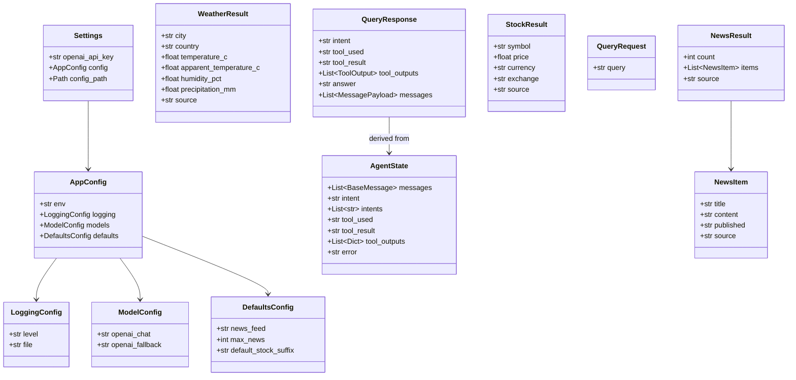
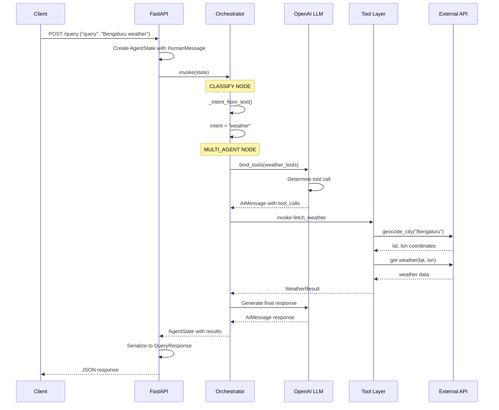
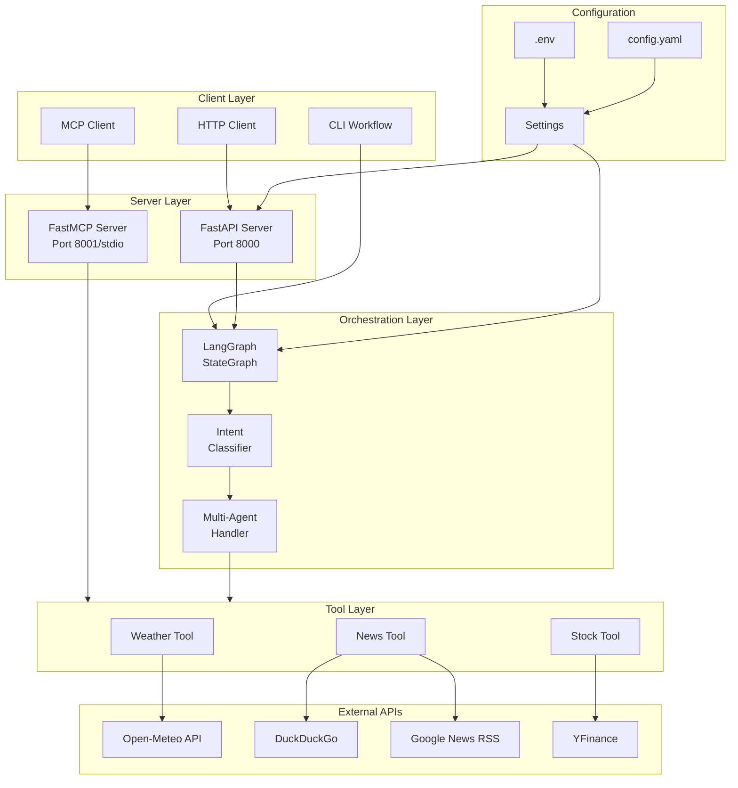
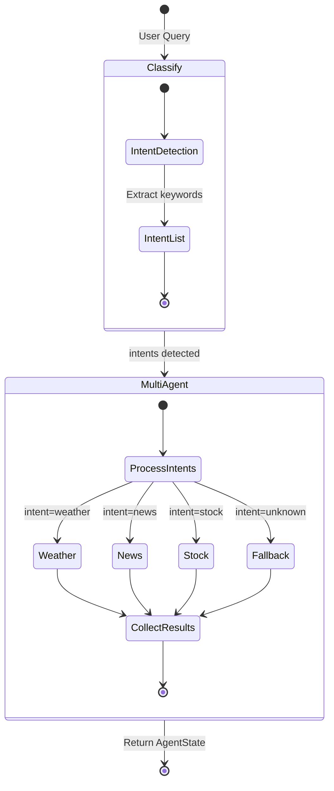

# Multi-Agent Orchestrator - Comprehensive Technical Documentation


---

## 📋 Table of Contents

1. [Executive Summary](#executive-summary)
2. [High-Level Architecture Overview](#high-level-architecture-overview)
3. [System Components](#system-components)
4. [UML Diagrams](#uml-diagrams)
5. [Workflow Diagrams](#workflow-diagrams)
6. [File-by-File Breakdown](#file-by-file-breakdown)
7. [Step-by-Step Execution Flow](#step-by-step-execution-flow)
8. [API Reference](#api-reference)
9. [Data Models](#data-models)
10. [Configuration Guide](#configuration-guide)
11. [Deployment Instructions](#deployment-instructions)

---

## 1. Executive Summary

### 1.1 Project Overview

The **Multi-Agent Orchestrator** is a production-ready AI assistant framework designed specifically for India-focused use cases. Built on cutting-edge technologies including **LangGraph** and **FastMCP**, this system orchestrates multiple specialized AI agents to handle diverse user queries effectively.

### 1.2 Key Features

| Feature | Description |
|---------|-------------|
| **Weather Agent** | Real-time weather data for Indian cities via Open-Meteo API |
| **News Agent** | Latest Indian news headlines via DuckDuckGo/RSS feeds |
| **Stock Agent** | Live stock prices from Indian exchanges (NSE/BSE) via YFinance |
| **Intent Classification** | Automatic routing based on user query analysis |
| **Multi-Intent Support** | Handle queries with multiple intents in a single request |
| **MCP Protocol** | Standard tool exposure via Model Context Protocol |

### 1.3 Technology Stack

```
┌─────────────────────────────────────────────────────────────────┐
│                        TECHNOLOGY STACK                         │
├─────────────────────────────────────────────────────────────────┤
│  Frontend/Client:  HTTP Client, CLI Workflow                    │
│  API Framework:    FastAPI (HTTP REST API)                      │
│  Orchestration:    LangGraph (State Machine)                    │
│  LLM:              OpenAI GPT-4o-mini                           │
│  Tools Protocol:   FastMCP (Model Context Protocol)             │
│  External APIs:    Open-Meteo, YFinance, Google News RSS        │
│  Data Validation:  Pydantic                                     │
│  Configuration:    YAML + python-dotenv                         │
└─────────────────────────────────────────────────────────────────┘
```

---

## 2. High-Level Architecture Overview

### 2.1 System Architecture Diagram

```
┌──────────────────────────────────────────────────────────────────────────────┐
│                           MULTI-AGENT ORCHESTRATOR                           │
│                              SYSTEM ARCHITECTURE                             │
├──────────────────────────────────────────────────────────────────────────────┤
│                                                                              │
│  ┌─────────────┐      ┌─────────────┐      ┌─────────────┐                   │
│  │   HTTP      │      │    CLI      │      │    MCP      │                   │
│  │   Client    │      │  Workflow   │      │   Client    │                   │
│  └──────┬──────┘      └──────┬──────┘      └──────┬──────┘                   │
│         │                    │                    │                          │
│         ▼                    ▼                    ▼                          │
│  ┌──────────────────────────────────────────────────────────────────┐        │
│  │                         SERVER LAYER                              │        │
│  │  ┌────────────────────────┐    ┌────────────────────────┐         │        │
│  │  │   FastAPI Server       │    │   FastMCP Server       │         │        │
│  │  │   (main.py)            │    │   (mcp_server.py)      │         │        │
│  │  │   - /health            │    │   - stdio mode         │         │        │
│  │  │   - /query             │    │   - HTTP mode          │         │        │
│  │  └──────────┬─────────────┘    └──────────┬─────────────┘         │        │
│  └─────────────┼──────────────────────────────┼──────────────────────┘        │
│                │                              │                              │
│                ▼                              ▼                              │
│  ┌──────────────────────────────────────────────────────────────────┐        │
│  │                      ORCHESTRATION LAYER                          │        │
│  │  ┌────────────────────────────────────────────────────────────┐   │        │
│  │  │              LangGraph State Machine                        │   │        │
│  │  │                  (orchestrator.py)                          │   │        │
│  │  │                                                              │   │        │
│  │  │   ┌──────────┐    ┌──────────────┐    ┌────────┐            │   │        │
│  │  │   │ CLASSIFY │───▶│ MULTI_AGENT  │───▶│  END   │            │   │        │
│  │  │   └──────────┘    └──────────────┘    └────────┘            │   │        │
│  │  └────────────────────────────────────────────────────────────┘   │        │
│  └───────────────────────────────────────────────────────────────────┘        │
│                │                                                              │
│                ▼                                                              │
│  ┌──────────────────────────────────────────────────────────────────┐        │
│  │                          TOOL LAYER                               │        │
│  │  ┌──────────────┐  ┌──────────────┐  ┌──────────────┐            │        │
│  │  │   Weather    │  │    News      │  │    Stock     │            │        │
│  │  │    Tool      │  │    Tool      │  │    Tool      │            │        │
│  │  │(weather.py)  │  │  (news.py)   │  │ (stock.py)   │            │        │
│  │  └──────┬───────┘  └──────┬───────┘  └──────┬───────┘            │        │
│  └─────────┼─────────────────┼─────────────────┼────────────────────┘        │
│            ▼                 ▼                 ▼                              │
│  ┌──────────────────────────────────────────────────────────────────┐        │
│  │                     EXTERNAL APIs                                 │        │
│  │  ┌──────────────┐  ┌──────────────┐  ┌──────────────┐            │        │
│  │  │  Open-Meteo  │  │  DuckDuckGo  │  │   YFinance   │            │        │
│  │  │  (Weather)   │  │  / RSS Feed  │  │   (Stocks)   │            │        │
│  │  └──────────────┘  └──────────────┘  └──────────────┘            │        │
│  └──────────────────────────────────────────────────────────────────┘        │
│                                                                              │
└──────────────────────────────────────────────────────────────────────────────┘
```

### 2.2 Architectural Patterns

| Pattern | Implementation | Purpose |
|---------|----------------|---------|
| **Microservices** | Separate FastAPI & MCP servers | Scalability & flexibility |
| **State Machine** | LangGraph StateGraph | Workflow orchestration |
| **Dependency Injection** | Settings singleton | Configuration management |
| **Factory Pattern** | `build_workflow()` | Dynamic workflow creation |
| **Adapter Pattern** | Tool wrappers | MCP-to-LangChain integration |

---

## 3. System Components

### 3.1 Component Overview

```
opensourcetools/
├── .env                      # Environment secrets (OPENAI_API_KEY)
├── .gitignore                # Git ignore rules
├── README.md                 # Project documentation
├── requirements.txt          # Python dependencies
├── logs/                     # Application logs
│   └── app.log               # Runtime log file
└── app/                      # Main application package
    ├── __init__.py           # Package initialization
    ├── config/               # Configuration management
    │   ├── __init__.py
    │   ├── config.yaml       # Application configuration
    │   └── settings.py       # Settings loader & validation
    ├── tools/                # MCP-compatible tools
    │   ├── __init__.py
    │   ├── weather.py        # Weather fetching tool
    │   ├── news.py           # News fetching tool
    │   └── stock.py          # Stock price tool
    ├── agents/               # LangGraph orchestration
    │   ├── __init__.py
    │   └── orchestrator.py   # Main workflow engine
    ├── server/               # Server implementations
    │   ├── __init__.py
    │   ├── main.py           # FastAPI HTTP server
    │   └── mcp_server.py     # FastMCP server
    └── client/               # Client utilities
        ├── __init__.py
        ├── http_client.py    # HTTP API client
        └── cli_workflow.py   # Direct CLI execution
```

### 3.2 Layer Responsibilities

| Layer | Components | Responsibility |
|-------|------------|----------------|
| **Presentation** | FastAPI, MCP Server | Handle incoming requests |
| **Business Logic** | Orchestrator | Intent classification & routing |
| **Service** | Tools (Weather, News, Stock) | Domain-specific operations |
| **External Integration** | API Clients | Third-party data fetching |
| **Configuration** | Settings, YAML | Environment & app configuration |

---

## 4. UML Diagrams

### 4.1 Class Diagram



### 4.2 Sequence Diagram - Query Processing



### 4.3 Component Diagram



### 4.4 State Machine Diagram



---

## 5. Workflow Diagrams

### 5.1 Main Application Workflow

```
┌─────────────────────────────────────────────────────────────────────────────────┐
│                           MAIN APPLICATION WORKFLOW                              │
├─────────────────────────────────────────────────────────────────────────────────┤
│                                                                                  │
│    ┌─────────────────┐                                                          │
│    │    START        │                                                          │
│    └────────┬────────┘                                                          │
│             │                                                                    │
│             ▼                                                                    │
│    ┌─────────────────┐                                                          │
│    │ Load Settings   │◀────┐                                                    │
│    │ (config.yaml +  │     │                                                    │
│    │  .env)          │     │                                                    │
│    └────────┬────────┘     │                                                    │
│             │              │                                                    │
│             ▼              │ Reload on                                          │
│    ┌─────────────────┐     │ config change                                      │
│    │ Configure       │     │                                                    │
│    │ Logging         │─────┘                                                    │
│    └────────┬────────┘                                                          │
│             │                                                                    │
│             ▼                                                                    │
│    ┌─────────────────┐                                                          │
│    │ Build Workflow  │                                                          │
│    │ (StateGraph)    │                                                          │
│    └────────┬────────┘                                                          │
│             │                                                                    │
│             ▼                                                                    │
│    ┌─────────────────┐                                                          │
│    │ Start FastAPI   │                                                          │
│    │ Server          │                                                          │
│    └────────┬────────┘                                                          │
│             │                                                                    │
│             ▼                                                                    │
│    ┌─────────────────┐                                                          │
│    │ READY TO        │◀───────────────────────────────┐                         │
│    │ ACCEPT REQUESTS │                                │                         │
│    └────────┬────────┘                                │                         │
│             │                                         │                         │
│             ▼                                         │                         │
│    ┌─────────────────┐         ┌─────────────────┐    │                         │
│    │ Receive Query   │────────▶│ Process Query   │────┘                         │
│    │ Request         │         │ (Orchestrator)  │                              │
│    └─────────────────┘         └─────────────────┘                              │
│                                                                                  │
└─────────────────────────────────────────────────────────────────────────────────┘
```

### 5.2 Intent Classification Workflow

```
┌─────────────────────────────────────────────────────────────────────────────────┐
│                        INTENT CLASSIFICATION WORKFLOW                            │
├─────────────────────────────────────────────────────────────────────────────────┤
│                                                                                  │
│    ┌────────────────────────────────────────────────────────────────────────┐    │
│    │                         USER QUERY INPUT                                │    │
│    │         "I need Bengaluru weather and today's news"                     │    │
│    └───────────────────────────────┬────────────────────────────────────────┘    │
│                                    │                                             │
│                                    ▼                                             │
│    ┌────────────────────────────────────────────────────────────────────────┐    │
│    │                        KEYWORD ANALYSIS                                 │    │
│    │                                                                         │    │
│    │   Text: "i need bengaluru weather and today's news"                     │    │
│    │         ↓                                                               │    │
│    │   ┌──────────────────────────────────────────────────────────────┐     │    │
│    │   │ WEATHER KEYWORDS: weather, temperature, rain, forecast       │     │    │
│    │   │                   ✓ "weather" FOUND!                        │     │    │
│    │   └──────────────────────────────────────────────────────────────┘     │    │
│    │   ┌──────────────────────────────────────────────────────────────┐     │    │
│    │   │ NEWS KEYWORDS: news, headline, update, breaking             │     │    │
│    │   │                ✓ "news" FOUND!                              │     │    │
│    │   └──────────────────────────────────────────────────────────────┘     │    │
│    │   ┌──────────────────────────────────────────────────────────────┐     │    │
│    │   │ STOCK KEYWORDS: stock, price, nifty, sensex, shares         │     │    │
│    │   │                 ✗ NOT FOUND                                  │     │    │
│    │   └──────────────────────────────────────────────────────────────┘     │    │
│    └───────────────────────────────┬────────────────────────────────────────┘    │
│                                    │                                             │
│                                    ▼                                             │
│    ┌────────────────────────────────────────────────────────────────────────┐    │
│    │                      INTENT RESOLUTION                                  │    │
│    │                                                                         │    │
│    │   intents = ["weather", "news"]                                         │    │
│    │   intent = "news" (last in list - primary)                              │    │
│    └───────────────────────────────┬────────────────────────────────────────┘    │
│                                    │                                             │
│                                    ▼                                             │
│    ┌────────────────────────────────────────────────────────────────────────┐    │
│    │                     ROUTE TO AGENTS                                     │    │
│    │                                                                         │    │
│    │   ┌─────────────┐    ┌─────────────┐    ┌─────────────┐                │    │
│    │   │   WEATHER   │    │    NEWS     │    │   STOCK     │                │    │
│    │   │    AGENT    │    │   AGENT     │    │   AGENT     │                │    │
│    │   │     ✓       │    │     ✓       │    │     ✗       │                │    │
│    │   └─────────────┘    └─────────────┘    └─────────────┘                │    │
│    └────────────────────────────────────────────────────────────────────────┘    │
│                                                                                  │
└─────────────────────────────────────────────────────────────────────────────────┘
```

### 5.3 Tool Execution Workflow

```
┌─────────────────────────────────────────────────────────────────────────────────┐
│                           TOOL EXECUTION WORKFLOW                                │
├─────────────────────────────────────────────────────────────────────────────────┤
│                                                                                  │
│    ┌────────────────┐                                                           │
│    │ SELECT TOOL    │                                                           │
│    │ based on intent│                                                           │
│    └───────┬────────┘                                                           │
│            │                                                                     │
│            ▼                                                                     │
│    ┌────────────────┐                                                           │
│    │ Bind Tools to  │     ┌─────────────────────────────────────┐               │
│    │ LLM            │────▶│ ChatOpenAI.bind_tools(tools)        │               │
│    └───────┬────────┘     └─────────────────────────────────────┘               │
│            │                                                                     │
│            ▼                                                                     │
│    ┌────────────────┐                                                           │
│    │ LLM Decides    │     Response contains:                                    │
│    │ Tool Call      │     - tool_name: "fetch_weather"                          │
│    │                │     - args: {"city": "Bengaluru", "country": "India"}     │
│    └───────┬────────┘                                                           │
│            │                                                                     │
│            ▼                                                                     │
│    ┌────────────────┐                                                           │
│    │  EXECUTE       │                                                           │
│    │  TOOL          │                                                           │
│    └───────┬────────┘                                                           │
│            │                                                                     │
│    ┌───────┴───────────────────────────────────────────────────────┐            │
│    │                                                                │            │
│    ▼                         ▼                          ▼           │            │
│    ┌────────────┐    ┌────────────┐    ┌────────────┐              │            │
│    │  Weather   │    │   News     │    │   Stock    │              │            │
│    │  Tool      │    │   Tool     │    │   Tool     │              │            │
│    └─────┬──────┘    └─────┬──────┘    └─────┬──────┘              │            │
│          │                 │                 │                      │            │
│          ▼                 ▼                 ▼                      │            │
│    ┌────────────┐    ┌────────────┐    ┌────────────┐              │            │
│    │ Open-Meteo │    │DuckDuckGo/ │    │  YFinance  │              │            │
│    │    API     │    │    RSS     │    │    API     │              │            │
│    └─────┬──────┘    └─────┬──────┘    └─────┬──────┘              │            │
│          │                 │                 │                      │            │
│    └─────┴─────────────────┴─────────────────┴──────────────────────┘            │
│            │                                                                     │
│            ▼                                                                     │
│    ┌────────────────┐                                                           │
│    │ Normalize      │     Convert to dict/str from Pydantic model               │
│    │ Result         │                                                           │
│    └───────┬────────┘                                                           │
│            │                                                                     │
│            ▼                                                                     │
│    ┌────────────────┐                                                           │
│    │ Add ToolMessage│     Append result to message history                      │
│    │ to State       │                                                           │
│    └───────┬────────┘                                                           │
│            │                                                                     │
│            ▼                                                                     │
│    ┌────────────────┐                                                           │
│    │ LLM Generates  │     Generate user-friendly response                       │
│    │ Final Answer   │     based on tool results                                 │
│    └────────────────┘                                                           │
│                                                                                  │
└─────────────────────────────────────────────────────────────────────────────────┘
```

---

## 6. File-by-File Breakdown

### 6.1 Configuration Layer

#### 📁 `app/config/settings.py`

**Purpose:** Central configuration management with environment variable loading and YAML parsing.

**Key Components:**

| Class/Function | Description |
|----------------|-------------|
| `LoggingConfig` | Pydantic model for logging settings (level, file path) |
| `ModelConfig` | Pydantic model for OpenAI model names |
| `DefaultsConfig` | Pydantic model for default values (news feed, stock suffix) |
| `AppConfig` | Composite config holding all sub-configurations |
| `Settings` | Main settings class with API key and config |
| `get_settings()` | Cached singleton function to load settings |
| `configure_logging()` | Sets up file and console logging handlers |

**Code Flow:**
```
1. Load .env file (python-dotenv)
2. Read config.yaml file
3. Parse YAML into AppConfig Pydantic model
4. Validate and return Settings object
5. Cache result for subsequent calls
```

#### 📁 `app/config/config.yaml`

**Purpose:** External configuration file for non-sensitive settings.

| Setting | Default Value | Description |
|---------|--------------|-------------|
| `env` | `dev` | Environment name |
| `logging.level` | `INFO` | Log verbosity |
| `logging.file` | `logs/app.log` | Log file path |
| `models.openai_chat` | `gpt-4o-mini` | Primary LLM model |
| `models.openai_fallback` | `gpt-4o-mini` | Fallback LLM model |
| `defaults.news_feed` | Google News RSS | Default news source |
| `defaults.max_news` | `10` | Maximum news items |
| `defaults.default_stock_suffix` | `.NS` | NSE exchange suffix |

---

### 6.2 Tool Layer

#### 📁 `app/tools/weather.py`

**Purpose:** Fetch real-time weather data for Indian cities using the Open-Meteo API (no API key required).

**Key Components:**

| Component | Type | Description |
|-----------|------|-------------|
| `WeatherResult` | Pydantic Model | Structured weather data response |
| `_geocode_city()` | Function | Convert city name to lat/lon coordinates |
| `_fetch_weather()` | Function | Get weather data from Open-Meteo |
| `fetch_weather()` | Main Function | Public API - complete weather fetch flow |
| `_CITY_NORMALIZATION` | Dictionary | Alias mapping for city names |

**Data Flow:**
```
User Input: "Bengaluru"
     │
     ▼
┌────────────────────────┐
│ Normalize City Name    │  "BANGALORE" → "Bengaluru"
└───────────┬────────────┘
            ▼
┌────────────────────────┐
│ Geocode via Open-Meteo │  GET /v1/search?name=Bengaluru
│ Geocoding API          │  Returns: lat=12.97, lon=77.59
└───────────┬────────────┘
            ▼
┌────────────────────────┐
│ Fetch Weather Data     │  GET /v1/forecast?lat=12.97&lon=77.59
│ from Open-Meteo        │  Returns: temp, humidity, precipitation
└───────────┬────────────┘
            ▼
┌────────────────────────┐
│ Return WeatherResult   │  Validated Pydantic model
└────────────────────────┘
```

---

#### 📁 `app/tools/news.py`

**Purpose:** Fetch latest news headlines with dual-source strategy (DuckDuckGo + RSS fallback).

**Key Components:**

| Component | Type | Description |
|-----------|------|-------------|
| `NewsItem` | Pydantic Model | Single news item structure |
| `NewsResult` | Pydantic Model | Collection of news items |
| `_scrape_duckduckgo()` | Function | HTML scrape from DuckDuckGo |
| `_parse_entries()` | Function | Parse RSS feed entries |
| `fetch_news()` | Main Function | Public API with fallback logic |

**Data Flow:**
```
User Query: "india news"
     │
     ▼
┌────────────────────────────────┐
│ Try DuckDuckGo HTML Scrape     │
│ GET https://duckduckgo.com/html│
│ ?q=india+India+news            │
└───────────┬────────────────────┘
            │
     ┌──────┴──────┐
     │  Results?   │
     └──────┬──────┘
            │
    Yes ────┴──── No
     │            │
     ▼            ▼
┌──────────┐  ┌────────────────────────┐
│ Return   │  │ Fallback to RSS Feed   │
│ DDG      │  │ feedparser.parse(url)  │
│ Results  │  └───────────┬────────────┘
└──────────┘              ▼
                   ┌────────────────────────┐
                   │ Parse & Return Results │
                   └────────────────────────┘
```

---

#### 📁 `app/tools/stock.py`

**Purpose:** Fetch real-time stock prices from Indian exchanges (NSE/BSE) using YFinance.

**Key Components:**

| Component | Type | Description |
|-----------|------|-------------|
| `StockResult` | Pydantic Model | Stock price data structure |
| `_SYMBOL_NORMALIZATION` | Dictionary | Symbol alias mapping |
| `_resolve_symbol()` | Function | Normalize user input symbols |
| `_latest_price()` | Function | Get price with fallback strategies |
| `fetch_stock()` | Main Function | Public API for stock fetching |

**Symbol Resolution:**
```
User Input: "HCL"
     │
     ▼
┌────────────────────────┐
│ Normalize Symbol       │  "HCL" → "HCLTECH"
└───────────┬────────────┘
            ▼
┌────────────────────────┐
│ Add Exchange Suffix    │  "HCLTECH" → "HCLTECH.NS"
└───────────┬────────────┘
            ▼
┌────────────────────────┐
│ Query YFinance         │  yf.Ticker("HCLTECH.NS")
└───────────┬────────────┘
            │
     ┌──────┴──────┐
     │ Price found?│
     └──────┬──────┘
            │
    Yes ────┴──── No
     │            │
     ▼            ▼
┌──────────┐  ┌────────────────────────┐
│ Return   │  │ Try without suffix     │
│ Result   │  │ yf.Ticker("HCLTECH")   │
└──────────┘  └────────────────────────┘
```

---

### 6.3 Agent Layer

#### 📁 `app/agents/orchestrator.py`

**Purpose:** Core LangGraph workflow implementation for multi-agent orchestration.

**Key Components:**

| Component | Type | Description |
|-----------|------|-------------|
| `AgentState` | Dataclass | Workflow state container |
| `_intent_from_text()` | Function | Single intent extraction |
| `_intents_from_text()` | Function | Multiple intent extraction |
| `_to_lc_tool()` | Function | MCP to LangChain adapter |
| `_run_tool_call()` | Function | Execute tool with LLM binding |
| `_run_fallback()` | Function | Handle unknown intents |
| `build_workflow()` | Main Function | Construct LangGraph StateGraph |

**State Machine Nodes:**

```
┌─────────────────────────────────────────────────────────────────┐
│                        STATE GRAPH                               │
├─────────────────────────────────────────────────────────────────┤
│                                                                  │
│  CLASSIFY NODE                    MULTI_AGENT NODE               │
│  ┌──────────────────────┐        ┌──────────────────────────┐   │
│  │ • Extract last user  │        │ • Iterate over intents   │   │
│  │   message            │        │ • For each intent:       │   │
│  │ • Run keyword        │   ───▶ │   - Bind appropriate     │   │
│  │   analysis           │        │     tools to LLM         │   │
│  │ • Set intent &       │        │   - Execute tool calls   │   │
│  │   intents            │        │   - Collect results      │   │
│  └──────────────────────┘        └──────────────────────────┘   │
│                                                                  │
│  Entry Point: CLASSIFY                                           │
│  Edge: CLASSIFY → MULTI_AGENT                                    │
│  Edge: MULTI_AGENT → END                                         │
│                                                                  │
└─────────────────────────────────────────────────────────────────┘
```

**AgentState Fields:**

| Field | Type | Description |
|-------|------|-------------|
| `messages` | `List[BaseMessage]` | Conversation history |
| `intent` | `str` | Primary detected intent |
| `intents` | `List[str]` | All detected intents |
| `tool_used` | `str` | Last tool executed |
| `tool_result` | `str` | Last tool result |
| `tool_outputs` | `List[Dict]` | All tool outputs |
| `error` | `str` | Error message if any |

---

### 6.4 Server Layer

#### 📁 `app/server/main.py`

**Purpose:** FastAPI HTTP server exposing the orchestrator as a REST API.

**Endpoints:**

| Endpoint | Method | Description |
|----------|--------|-------------|
| `/health` | GET | Health check endpoint |
| `/query` | POST | Main query processing endpoint |

**Request/Response Models:**

```python
# Request
class QueryRequest:
    query: str  # User's question

# Response
class QueryResponse:
    intent: str           # Detected intent
    tool_used: str        # Tool that was invoked
    tool_result: str      # Raw tool output
    tool_outputs: List    # All tool outputs
    answer: str           # LLM-formatted response
    messages: List        # Full conversation history
```

**Startup Flow:**
```
1. Import settings (get_settings())
2. Configure logging (configure_logging())
3. Build workflow (build_workflow())
4. Initialize FastAPI app
5. Add CORS middleware
6. Register endpoints
7. Export app for uvicorn
```

---

#### 📁 `app/server/mcp_server.py`

**Purpose:** FastMCP server exposing tools for MCP-compatible clients.

**Server Modes:**

| Mode | Function | Port | Use Case |
|------|----------|------|----------|
| stdio | `run_stdio()` | N/A | Local development, IDE integration |
| HTTP | `run_http()` | 8001 | Remote clients, testing |

**Tool Registration:**
```python
server.add_tool(FunctionTool.from_function(weather.fetch_weather))
server.add_tool(FunctionTool.from_function(news_wrapper))
server.add_tool(FunctionTool.from_function(stock_wrapper))
```

---

### 6.5 Client Layer

#### 📁 `app/client/http_client.py`

**Purpose:** Lightweight HTTP client for testing the FastAPI server.

**Functions:**

| Function | Description |
|----------|-------------|
| `query_api()` | Send query to orchestrator and return response |
| `main()` | CLI entry point with argument parsing |

**Usage:**
```bash
python -m app.client.http_client "What is the weather in Delhi?"
```

---

#### 📁 `app/client/cli_workflow.py`

**Purpose:** Direct workflow execution without HTTP server (local testing).

**Functions:**

| Function | Description |
|----------|-------------|
| `format_message()` | Convert BaseMessage to readable string |
| `main()` | Build and invoke workflow, print trace |

**Usage:**
```bash
python -m app.client.cli_workflow "I need HCL stock price"
```

**Output Format:**
```
=== Execution Trace ===
user: I need HCL stock price
assistant: [tool_call: fetch_stock]
tool[call_123]: {"symbol": "HCLTECH", "price": 1234.50...}
assistant: The current price of HCL Technologies...

=== Summary ===
Intent     : stock
Tool used  : stock
Tool result: {"symbol": "HCLTECH", "price": 1234.50...}
```

---

## 7. Step-by-Step Execution Flow

### 7.1 Complete Request Lifecycle

```
┌─────────────────────────────────────────────────────────────────────────────────┐
│                          COMPLETE REQUEST LIFECYCLE                              │
├─────────────────────────────────────────────────────────────────────────────────┤
│                                                                                  │
│  STEP 1: APPLICATION STARTUP                                                     │
│  ═══════════════════════════                                                     │
│  ┌──────────────────────────────────────────────────────────────────────────┐   │
│  │ 1.1  Python loads app/server/main.py                                      │   │
│  │ 1.2  get_settings() reads .env and config.yaml                            │   │
│  │ 1.3  configure_logging() sets up log handlers                             │   │
│  │ 1.4  build_workflow() creates LangGraph StateGraph                        │   │
│  │ 1.5  FastAPI app initialized with CORS middleware                         │   │
│  │ 1.6  uvicorn starts listening on port 8000                                │   │
│  └──────────────────────────────────────────────────────────────────────────┘   │
│                                                                                  │
│  STEP 2: REQUEST RECEPTION                                                       │
│  ═════════════════════════                                                       │
│  ┌──────────────────────────────────────────────────────────────────────────┐   │
│  │ 2.1  Client sends POST /query with JSON body                              │   │
│  │      {"query": "I need Bengaluru weather today"}                          │   │
│  │ 2.2  FastAPI validates request against QueryRequest model                 │   │
│  │ 2.3  Logger records incoming query                                        │   │
│  │ 2.4  Create AgentState with HumanMessage                                  │   │
│  └──────────────────────────────────────────────────────────────────────────┘   │
│                                                                                  │
│  STEP 3: CLASSIFY NODE EXECUTION                                                 │
│  ═══════════════════════════════                                                 │
│  ┌──────────────────────────────────────────────────────────────────────────┐   │
│  │ 3.1  workflow.invoke(state) enters CLASSIFY node                          │   │
│  │ 3.2  Extract last HumanMessage from state.messages                        │   │
│  │ 3.3  Run _intent_from_text() - checks for keywords:                       │   │
│  │      • "weather" found → intent = "weather" ✓                             │   │
│  │ 3.4  Run _intents_from_text() - builds list:                              │   │
│  │      • intents = ["weather"]                                              │   │
│  │ 3.5  Log routing decision: "Routing intents=['weather']"                  │   │
│  │ 3.6  Transition to MULTI_AGENT node                                       │   │
│  └──────────────────────────────────────────────────────────────────────────┘   │
│                                                                                  │
│  STEP 4: MULTI_AGENT NODE EXECUTION                                              │
│  ═══════════════════════════════════                                             │
│  ┌──────────────────────────────────────────────────────────────────────────┐   │
│  │ 4.1  For intent "weather" in intents:                                     │   │
│  │ 4.2  Call _run_tool_call() with weather_tools                             │   │
│  │ 4.3  Bind weather tool to ChatOpenAI LLM                                  │   │
│  │ 4.4  LLM analyzes message, generates tool_call:                           │   │
│  │      {"name": "fetch_weather", "args": {"city": "Bengaluru"}}             │   │
│  │ 4.5  Append AIMessage with tool_call to messages                          │   │
│  └──────────────────────────────────────────────────────────────────────────┘   │
│                                                                                  │
│  STEP 5: TOOL EXECUTION                                                          │
│  ═════════════════════                                                           │
│  ┌──────────────────────────────────────────────────────────────────────────┐   │
│  │ 5.1  Find weather tool object by name                                     │   │
│  │ 5.2  Invoke tool.invoke({"city": "Bengaluru"})                            │   │
│  │ 5.3  weather.fetch_weather() executes:                                    │   │
│  │      a) Normalize city: "Bengaluru" (no change)                           │   │
│  │      b) Geocode via Open-Meteo: lat=12.97, lon=77.59                      │   │
│  │      c) Fetch weather data from Open-Meteo forecast API                   │   │
│  │      d) Construct WeatherResult Pydantic model                            │   │
│  │ 5.4  Normalize result to dict using model_dump()                          │   │
│  │ 5.5  Append to state.tool_outputs                                         │   │
│  │ 5.6  Create ToolMessage with result, append to messages                   │   │
│  └──────────────────────────────────────────────────────────────────────────┘   │
│                                                                                  │
│  STEP 6: FINAL RESPONSE GENERATION                                               │
│  ═════════════════════════════════                                               │
│  ┌──────────────────────────────────────────────────────────────────────────┐   │
│  │ 6.1  LLM.invoke(messages) - generate final response                       │   │
│  │ 6.2  LLM synthesizes weather data into natural language:                  │   │
│  │      "The current weather in Bengaluru is 28°C with 65% humidity..."      │   │
│  │ 6.3  Append final AIMessage to messages                                   │   │
│  │ 6.4  Update state: tool_used="weather", tool_result=<json>                │   │
│  │ 6.5  Transition to END node                                               │   │
│  └──────────────────────────────────────────────────────────────────────────┘   │
│                                                                                  │
│  STEP 7: RESPONSE SERIALIZATION                                                  │
│  ═════════════════════════════                                                   │
│  ┌──────────────────────────────────────────────────────────────────────────┐   │
│  │ 7.1  _as_agent_state() normalizes workflow result                         │   │
│  │ 7.2  Extract last AIMessage as answer                                     │   │
│  │ 7.3  Build QueryResponse:                                                 │   │
│  │      • intent: "weather"                                                  │   │
│  │      • tool_used: "weather"                                               │   │
│  │      • tool_result: "{...weather data...}"                                │   │
│  │      • answer: "The current weather in Bengaluru..."                      │   │
│  │      • messages: [user, assistant, tool, assistant]                       │   │
│  │ 7.4  Log response: "Response intent=weather tool=weather"                 │   │
│  │ 7.5  Return JSON response to client                                       │   │
│  └──────────────────────────────────────────────────────────────────────────┘   │
│                                                                                  │
└─────────────────────────────────────────────────────────────────────────────────┘
```

### 7.2 Multi-Intent Request Flow

When a query contains multiple intents (e.g., "weather in Delhi and news today"):

```
Query: "I need Delhi weather and latest news"
                    │
                    ▼
            ┌───────────────┐
            │    CLASSIFY   │
            │ intents=[     │
            │   "weather",  │
            │   "news"      │
            │ ]             │
            └───────┬───────┘
                    │
                    ▼
            ┌───────────────┐
            │  MULTI_AGENT  │
            └───────┬───────┘
                    │
        ┌───────────┴───────────┐
        ▼                       ▼
┌───────────────┐       ┌───────────────┐
│ WEATHER AGENT │       │  NEWS AGENT   │
│               │       │               │
│ 1. Bind tools │       │ 1. Bind tools │
│ 2. LLM decide │       │ 2. LLM decide │
│ 3. fetch_     │       │ 3. fetch_news │
│    weather()  │       │    ()         │
│ 4. Add result │       │ 4. Add result │
└───────┬───────┘       └───────┬───────┘
        │                       │
        └───────────┬───────────┘
                    ▼
            ┌───────────────┐
            │ Combine all   │
            │ tool_outputs  │
            │ in state      │
            └───────┬───────┘
                    │
                    ▼
            ┌───────────────┐
            │ Final LLM     │
            │ response with │
            │ both results  │
            └───────────────┘
```

---

## 8. API Reference

### 8.1 REST API Endpoints

#### GET /health

Health check endpoint for monitoring and load balancers.

**Request:**
```http
GET /health HTTP/1.1
Host: localhost:8000
```

**Response:**
```json
{
    "status": "ok"
}
```

---

#### POST /query

Main query processing endpoint.

**Request:**
```http
POST /query HTTP/1.1
Host: localhost:8000
Content-Type: application/json

{
    "query": "I need Bengaluru weather today"
}
```

**Response:**
```json
{
    "intent": "weather",
    "tool_used": "weather",
    "tool_result": "{\"city\": \"Bengaluru\", \"country\": \"India\", \"temperature_c\": 28.5, \"humidity_pct\": 65.0, \"source\": \"open-meteo.com\"}",
    "tool_outputs": [
        {
            "tool": "fetch_weather",
            "label": "weather",
            "result": {
                "city": "Bengaluru",
                "country": "India",
                "temperature_c": 28.5,
                "apparent_temperature_c": 30.2,
                "humidity_pct": 65.0,
                "precipitation_mm": 0.0,
                "source": "open-meteo.com"
            }
        }
    ],
    "answer": "The current weather in Bengaluru, India is 28.5°C (feels like 30.2°C) with 65% humidity and no precipitation.",
    "messages": [
        {"role": "user", "content": "I need Bengaluru weather today"},
        {"role": "assistant", "content": ""},
        {"role": "tool", "content": "{...}"},
        {"role": "assistant", "content": "The current weather in Bengaluru..."}
    ]
}
```

---

### 8.2 MCP Tool API

#### fetch_weather

Fetch current weather for an Indian city.

| Parameter | Type | Required | Description |
|-----------|------|----------|-------------|
| `city` | string | Yes | City name (e.g., "Bengaluru", "Delhi") |
| `country` | string | No | Country name (default: "India") |

**Returns:** `WeatherResult` object

---

#### fetch_news

Fetch latest India news headlines.

| Parameter | Type | Required | Description |
|-----------|------|----------|-------------|
| `topic` | string | No | Topic filter (default: "india") |
| `feed_url` | string | No | RSS feed URL (default: Google News India) |
| `limit` | integer | No | Max items to return (default: 10, max: 25) |

**Returns:** `NewsResult` object

---

#### fetch_stock

Fetch latest stock price for an Indian ticker.

| Parameter | Type | Required | Description |
|-----------|------|----------|-------------|
| `symbol` | string | Yes | Stock symbol (e.g., "HCLTECH", "INFY") |
| `exchange_suffix` | string | No | Exchange suffix (default: ".NS" for NSE) |

**Returns:** `StockResult` object

---

## 9. Data Models

### 9.1 Pydantic Model Reference

```python
# Weather Result
class WeatherResult(BaseModel):
    city: str                           # City name
    country: str                        # Country name
    temperature_c: float                # Temperature in Celsius
    apparent_temperature_c: float       # Feels like temperature
    humidity_pct: float                 # Relative humidity %
    precipitation_mm: float             # Current precipitation
    source: str = "open-meteo.com"      # Data source

# News Item
class NewsItem(BaseModel):
    title: str                          # Headline
    content: str                        # Summary/snippet
    published: Optional[str]            # ISO timestamp
    source: Optional[str]               # News source name

# News Result
class NewsResult(BaseModel):
    count: int                          # Number of items
    items: List[NewsItem]               # News items
    source: str                         # Feed source

# Stock Result
class StockResult(BaseModel):
    symbol: str                         # Ticker symbol
    price: float                        # Current price
    currency: Optional[str]             # Currency code
    exchange: Optional[str]             # Exchange name
    source: str = "yfinance"            # Data source
```

### 9.2 Agent State Model

```python
@dataclass
class AgentState:
    messages: List[BaseMessage] = field(default_factory=list)
    intent: str = "unknown"
    intents: List[str] = field(default_factory=list)
    tool_used: Optional[str] = None
    tool_result: Optional[str] = None
    tool_outputs: List[Dict[str, Union[dict, str]]] = field(default_factory=list)
    error: Optional[str] = None
```

---

## 10. Configuration Guide

### 10.1 Environment Variables

Create a `.env` file in the project root:

```env
# Required
OPENAI_API_KEY=sk-your-openai-api-key-here

# Optional
ORCHESTRATOR_URL=http://localhost:8000
```

### 10.2 YAML Configuration

Edit `app/config/config.yaml`:

```yaml
# Environment name
env: dev

# Logging configuration
logging:
  level: INFO           # DEBUG, INFO, WARNING, ERROR
  file: logs/app.log    # Log file path

# OpenAI model configuration
models:
  openai_chat: gpt-4o-mini       # Primary model
  openai_fallback: gpt-4o-mini   # Fallback model

# Default values for tools
defaults:
  news_feed: "https://news.google.com/rss?hl=en-IN&gl=IN&ceid=IN:en"
  max_news: 10                    # Maximum news items
  default_stock_suffix: ".NS"     # NSE suffix
```

---

## 11. Deployment Instructions

### 11.1 Local Development Setup

```bash
# 1. Create virtual environment
python -m venv .venv

# 2. Activate (Windows)
.venv\Scripts\activate

# 3. Install dependencies
pip install -r requirements.txt

# 4. Create .env file
echo OPENAI_API_KEY=sk-your-key > .env

# 5. Start FastAPI server
uvicorn app.server.main:app --host 0.0.0.0 --port 8000 --reload
```

### 11.2 Running MCP Server

```bash
# stdio mode (for IDE integration)
python -m app.server.mcp_server

# HTTP mode (port 8001)
python -c "from app.server.mcp_server import run_http; run_http()"
```

### 11.3 Testing Queries

```bash
# Using curl
curl -X POST http://localhost:8000/query \
  -H "Content-Type: application/json" \
  -d '{"query": "I need Bengaluru weather today"}'

# Using CLI client
python -m app.client.http_client "I need Delhi weather"

# Using direct workflow
python -m app.client.cli_workflow "What is HCL stock price?"
```

---

## 12. Summary & Key Takeaways

### Architecture Highlights

| Aspect | Implementation |
|--------|----------------|
| **Pattern** | Multi-Agent Orchestration |
| **State Management** | LangGraph StateGraph |
| **Tool Protocol** | FastMCP (Model Context Protocol) |
| **API Framework** | FastAPI with async support |
| **LLM Integration** | LangChain + OpenAI |
| **Configuration** | YAML + dotenv |

### System Flow Summary

```
User Query → FastAPI → LangGraph Workflow → Intent Classification
     ↓
Agent Selection → Tool Binding → LLM Tool Decision
     ↓
Tool Execution (Weather/News/Stock) → External API Calls
     ↓
Result Collection → LLM Response Generation → JSON Response
```

### Extensibility Points

1. **Add New Tools:** Create new file in `app/tools/`, register in orchestrator
2. **Add New Intents:** Update keyword lists in `_intents_from_text()`
3. **Add New Agents:** Create tool bindings in `build_workflow()`
4. **Change LLM:** Update `models.openai_chat` in config.yaml

---

> **Document Version:** 1.0  
> **Last Updated:** January 2026  
> **Author:** Technical Documentation Team

---

*This document provides comprehensive coverage of the Multi-Agent Orchestrator project for presentation and technical reference purposes.*
